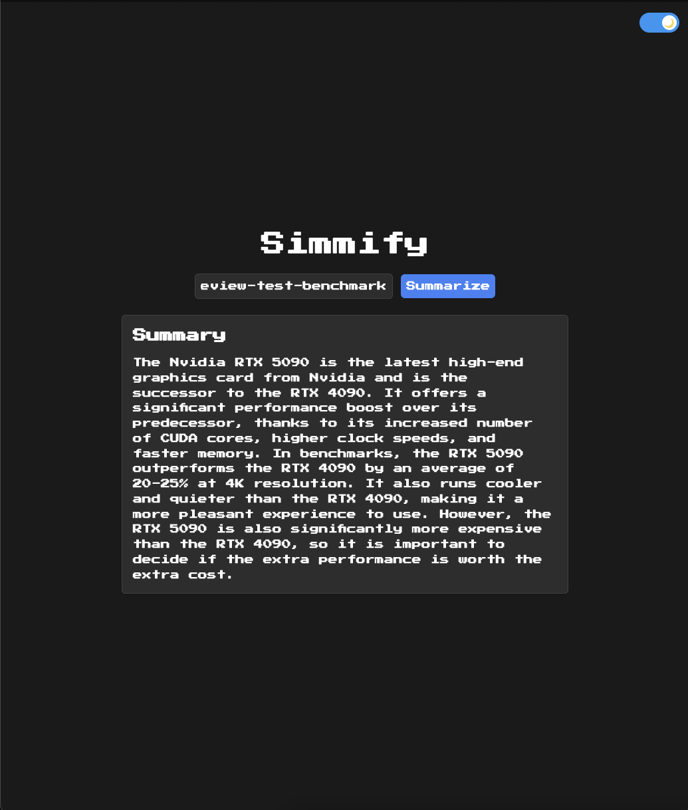

# Simmify - URLs Summarizer

A web application that transforms lengthy articles into summaries, for students who want to optimize their reading workflow.

## About

This project combines the power of AI summarization with a nostalgic pixel art aesthetic. Created out of necessity during my article research, Simmify aims to make literature review more efficient while bringing a touch of retro gaming charm to scholarly work.

## Features
- One-click article summarization
- Dark/Light mode toggle
- Powered by Google's Gemini Pro AI
- Responsive design
- Pixel art font and UI elements
- Works with any web article

## Technologies Used
- Frontend:
  - HTML5
  - CSS3 (Tailwind)
  - JavaScript
  - Press Start 2P Font
- Backend:
  - Node.js
  - Express
  - MongoDB
  - Google Gemini Pro API

## How to Use
1. Clone the repository: git clone https://github.com/nigelnh/Summify.git
2. Install dependencies: npm install
3. Set up your environment variables:
GEMINI_API_URL="https://generativelanguage.googleapis.com/v1/models/gemini-pro:generateContent";
MONGODB_URI="..."
4. Start the application: npm start

## Core Features
- Instant article summarization
- Academic-focused content processing
- Dark mode for late-night study sessions
- Responsive design for all devices
- RESTful API architecture
- Cross-browser compatibility

## Future Enhancements
[✧] PDF document support
[✧] Citation extraction
[✧] Multiple summary lengths
[✧] Export functionality
[✧] Browser extension
